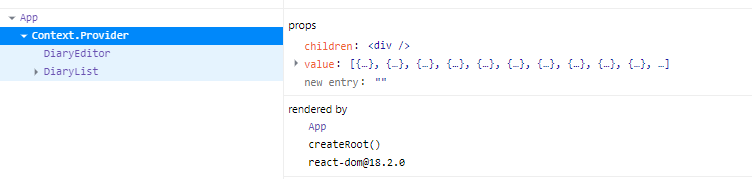
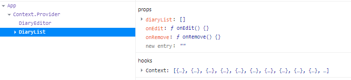

# React 강좌를 들으며 학습하는 프로젝트 #

## 1. 원 페이지 일기장 만들기 
### 일기장 작성, 저장 ###
```javascript
    //일기장 작성은 DiaryEditor.js에서 진행
    //App.js에서 useState가 들어간 function을 props받아 값을 저장할때 쓰였다.
    
    //App.js
    const onCreate = (author, content, emotion) => {
    const created_date = new Date().getTime();
    const newItem = {
      author,
      content,
      emotion,
      created_date,
      dataId: dataId.current
    };
    dataId.current++;
    setData([newItem, ...data]);
  }
  
  //DiaryEditor.js
  const DiaryEditor = ({ onCreate }) => {
  ...
  const handleSubmit = () => {
       ...
        onCreate(state.author, state.content, state.emotion);
        alert("저장 성공");
        setState({
            author: "", content: "", emotion: 1,
        })
    }
  ...
  return <div className="DiaryEditor">
  ...
  <button type="submit" onClick={handleSubmit}>일기 저장하기</button>
  ...
 ```
 
 ### 일기장 출력 ###
 ```javascript
    //App.js -> DiaryList.js -> DiaryItem.js 
    //각 일기장들의 출력은 DiaryItem.js에서 작성하였다.
    
    
    //DiaryList.js
    <DiaryItem key={it.dataId} {...it} onRemove={onRemove} onEdit={onEdit} />
    //DiaryList에서는 DiayItem.js에 ...it의 형태로 data 값을 넘겼다.
    
    //DiaryItem.js
    const DiaryItem = ({
    author,
    content,
    created_date,
    emotion,
    dataId,
    onRemove,
    onEdit }) => {
    //DiaryItem.js에서는 위와 같이 값들을 받아 사용하고 있다.
 ```
 ### 일기장 삭제
 ```javascript
    //App.js
    const onRemove = (targetId) => {
        const newDiaryList = data.filter((data) => data.dataId !== targetId);
        setData(newDiaryList);
    }
    //App.js에서 onRemove function을 작성하고 그 안에 setData를 사용하여 state를 갱신할 수 있게 했다.
    
    <DiaryList onEdit={onEdit} diaryList={data} onRemove={onRemove} />
    //DiaryList태그에 넣어 props로 보내어 하위 컴포넌트에서 onRemove()를 사용할 수 있게 함.
    
    //DiaryList.js
    const DiaryList = ({ diaryList, onRemove, onEdit }) => {
    ...
    <DiaryItem key={it.dataId} {...it} onRemove={onRemove} onEdit={onEdit} />
    ...
    //DiaryList에서는 DiaryItem.js로 onRemove()를 전달
    
    //DiaryItem.js
    const DiaryItem = ({
    author,
    content,
    created_date,
    emotion,
    dataId,
    onRemove,
    onEdit }) => {
    ...
    const handleRemove = () => {
        if (window.confirm(`${dataId}번째 일기를 정말 삭제하시겠습니까?`)) {
            onRemove(dataId);
        }
    };
    ...
    <button onClick={handleRemove}>삭제하기</button>
    
    //DiaryItem.js에서 onRemove()를 받아 handleRemove() function 내부에서 사용하도록 함
 
 ```
 ### 일기장 수정


## 2. React Lifecycle 제어하기

## 3. React에서 API 호출하기
```javascript
 const res = await fetch('https://jsonplaceholder.typicode.com/comments').then((res) => res.json());
 //에서 fetch 로 리로스를 비동기 요청을 할 수 있다.
 //fetch에는 기본적으로 첫번째 인자에 요청할 url이 들어간다
 
 const initData = res.slice(0, 20).map((it) => {
       return {
         author: it.email,
         content: it.body,
         emotion: Math.floor(Math.random() * 5) + 1,
         created_date: new Date().getTime(),
         id: dataId.current++
       }
     })
     setData(initData);
//res에는 500개의 데이터가 들어있는데 res.slice를 이용하여 20개만 자른 뒤 필요한 데이터만 사용하였다.
```

## 4. 복잡한 상태변화 로직 분리 (useReducer)
->컴포넌트에서 상태변화를 분리
``useState``대신 ``useReduer``를 사용하는 이유는 복잡한 상태변화 로직을 컴포넌트 밖으로 분리하기 위함이다.
```javascript
const [data, dispatch] = useReducer(reducer, []);
```
dispatch를 호출하면 reducer()가 작동하고 reducer에서 return한 값이 date(state)에 저장된다.

또한 상태변화 로직을 컴포넌트 밖으로 분리하기 위함으로 reducer()함수는 컴포넌트 밖에다가 정의한다.

```javascript
const reducer = (state, action) => {
  switch (action.type) {
    case "INIT": {    }
    case "CREATE": {    }
    case "REMOVE": {    }
    case "EDIT": {    }
    default: {return state;}
  }
}
function App() {
...}

```
먼저 reducer의 틀을 만들어준다.

여기서 state는 위에서 정의한 data의 값을 가지고 있으며 action에는 dispatch를 호출할때 들어갈 인자값을 가지고 있다.

<details>
<summary>INIT</summary>

```javascript
/* 변경 전 init */
    const initData = res.slice(0, 20).map((it) => {
      return {
        author: it.email,
        content: it.body,
        emotion: Math.floor(Math.random() * 5) + 1,
        created_date: new Date().getTime(),
        id: dataId.current++
      }
    })
    setData(initData);
  };
  
  
/* 변경 후 init */
    const initData = res.slice(0, 20).map((it) => {
      return {
        author: it.email,
        content: it.body,
        emotion: Math.floor(Math.random() * 5) + 1,
        created_date: new Date().getTime(),
        dataId: dataId.current++
      }
    })
    dispatch({ type: "INIT", data: initData })
  };
```

해당 부분에서는 ``setData(initData)``만 수정되었다. <br />
그리고 reducer()에는 아래와 같이 추가해준다.

```javascript
const reducer = (state, action) => {
  switch (action.type) {
    case "INIT": {  
        return action.data
    }
    case "CREATE": {    }
    case "REMOVE": {    }
    case "EDIT": {    }
    default: {return state;}
  }
}
function App() {
...}
```

</details>

<details>
<summary>CREATE</summary>

```javascript
/* 변경 전 create  */
  const onCreate = (author, content, emotion) => {
    const created_date = new Date().getTime();
    const newItem = {
      author,
      content,
      emotion,
      created_date,
      dataId: dataId.current
    };
    dataId.current++;
    setData([newItem, ...data]);
  }
  
  
/* 변경 후 create */
  const onCreate = (author, content, emotion) => {
    dispatch({
      type: "CREATE",
      data: {
        author,
        content,
        emotion,
        dataId: dataId.current
      }
    })
    dataId.current++;
  }
```

바로 ``dispatch``로 인자값을 전달하고 작성 시간은 ``reducer()``에서 추가한다.

```javascript
const reducer = (state, action) => {
  switch (action.type) {
    case "INIT": {  
        return action.data
    }
    case "CREATE": {
      const create_date = new Date().getTime();
      const newItem = {
        ...action.data,
        create_date,
      }
      return [newItem, ...state];
    }
    case "REMOVE": {    }
    case "EDIT": {    }
    default: {return state;}
  }
}
function App() {
...}
```

</details>

<details>
<summary>REMOVE</summary>

```javascript
/* 변경 전 remove  */
  const onRemove = (targetId) => {
    const newDiaryList = data.filter((data) => data.dataId !== targetId);
    setData(newDiaryList);
  }
  
  
/* 변경 후 remove */
  const onRemove = (targetId) => {
    dispatch({ type: "REMOVE", targetId })
  }
```

``dispatch``에는 type값과 targetId를 전달한다.

```javascript
const reducer = (state, action) => {
  switch (action.type) {
    case "INIT": {  
        return action.data
    }
    case "CREATE": {
      const create_date = new Date().getTime();
      const newItem = {
        ...action.data,
        create_date,
      }
      return [newItem, ...state];
    }
    case "REMOVE": {
      return state.filter((it) => it.dataId !== action.targetId)
    }
    case "EDIT": {    }
    default: {return state;}
  }
}
function App() {
...}
```

``state.filter``를 사용하여 ``dataId``와 ``targetId``가 일치하지 않는 데이터들만 저장하며 리턴한다.

</details>

<details>
<summary>EDIT</summary>

```javascript
/* 변경 전 edit  */
  const onEdit = (targetId, newContent) => {
    setData(
      data.map(it => it.dataId === targetId ? { ...it, content: newContent } : it
      )
    );
  };
  
  
/* 변경 후 edit */
  const onEdit = (targetId, newContent) => {
    dispatch({
      type: "EDIT", targetId, newContent
    })
  }
```

``setData``대신 ``dispatch``를 사용하여 type과 targetId, newContent값을 전달한다.

```javascript
const reducer = (state, action) => {
  switch (action.type) {
    case "INIT": {  
        return action.data
    }
    case "CREATE": {
      const create_date = new Date().getTime();
      const newItem = {
        ...action.data,
        create_date,
      }
      return [newItem, ...state];
    }
    case "REMOVE": {
      return state.filter((it) => it.dataId !== action.targetId)
    }
    case "EDIT": {
      return state.map(it => it.dataId === action.targetId ? {
        ...it, content: action.newContent
      } : it)
    }
    default: {return state;}
  }
}
function App() {
...}
```

</details>

<br />


## 5. 컴포넌트 트리에 데이터 공급하기 (Context)
1. 모든 데이터를 가지고 있는 컴포넌트가 Provider라는 공급자 역할을 하는 자식 컴포넌트에게 자신이 가진 모든 데이터를 넘긴다.
    
2. 공급자 Provider컴포넌트는 자신의 자손에 해당하는 컴포넌트들에게 직접적으로 데이터를 전달할 수 있다.
- 자손들은 Provider 컴포넌트에게 직통으로 데이터를 받을 수 있다. 
- 쓸데없이 props를 전달만하는 코드를 줄일 수 있음

    
#### Context 생성
``const MyContext =  React.createContext(defaultValue);``

#### Context Provider를 통한 데이터 공급 (data)
```javascript
<MyContext.Provider
  value={전역으로 전달하고자 하는 값}>{ /* 자식 컴포넌트들 */ } 
</MyContext.Provider>
```

이제 직접 코드에 적용해본다.

```javascript
/* App.js */
export const DiaryStateContext = React.createContext();
```

위의 코드를 추가하였다면 return에서도 수정할 부분이 생긴다.

```javascript
return (
    <DiaryStateContext.Provider value={data}>
      <div className='App'>
        <DiaryEditor onCreate={onCreate} />
        <DiaryList onEdit={onEdit} onRemove={onRemove} />
      </div>
    </DiaryStateContext.Provider>
  );
```

DiaryStateContext 컨텍스트가 가지고 있는 provider라는 컴포넌트를 사용한다.<br />
App컴포넌트가 return하고 있는 태그를 ``<DiaryStateContext.Provier>``태그로 랩핑해준다.

그리고 전역으로 쓰고싶은 값을 ``<DiaryStateContext.Provier>``태그의 value라는 prop으로 지정해주면 된다.

<br/>



개발툴의 Componenets를 확인해보면 Context.Provider가 태그들의 상위에 있으며 props에는 value에 data값을 가지고 있는 것을 알 수 있다.
<br />

##### 자손이 Provier값을 사용하기

```javascript
/* DirayList.js */
import { useContext } from "react";
import { DiaryStateContext } from "./App";
import DiaryItem from "./DiaryItem";

const DiaryList = ({ onRemove, onEdit }) => {
    const diaryList = useContext(DiaryStateContext);
    
    return <div className="DiaryList">
        <h2>일기 리스트</h2>
        <h4>{diaryList.length}개의 일기가 있습니다.</h4>
        <div>
            {diaryList.map((it) => (
                <DiaryItem key={it.dataId} {...it} onRemove={onRemove} onEdit={onEdit} />
            ))}
        </div>
    </div>
}

```

provider에게 data를 받으면 되기 때문에 prop으로 받은 dataList은 지워두었다.<br />
``provider``의 값을 사용할 때는 **``useContext()``** 라는 hook을 사용한다. <br/><br/>
대신 ``useContext()``를 사용할때 한가지 인자를 전달해야하는데, 우리가 값을 꺼내고 싶은 context를 전달하면 된다.
(현재 코드에서는 ``DiaryStateContext``를 import를 받아 사용하면 된다)




DiaryList를 보면 hooks에 data값들을 받아오고 있는 것을 확인 할 수 있다.
     
#### Context Provider를 통한 데이터 공급 (onCreate, onRemove, onEdit...)
해당 기능들도 provider로 공급할 수 있다.
하지만 provdier도 결국에는 컴포넌트이다. 즉  prop이 바꿔버리면 재 생성되버린다 -> 하위이 컴포넌트들도 모두 재 생성된다.
그러니 data와 같은 context를 사용하지 않고 중첩하여 사용한다.

```javascript
export const DiaryDispatchContext = React.createContext();

...

const memoizeDispatch = useMemo(() => {
    return { onCreate, onRemove, onEdit }
  }, [])

  return (
    <DiaryStateContext.Provider value={data}>
      <DiaryDispatchContext.Provider value={memoizeDispatch}>
        <div className='App'>
          <DiaryEditor />
          <DiaryList />
        </div>
      </DiaryDispatchContext.Provider>
    </DiaryStateContext.Provider>
  );
```

useMemo를 사용하지 않을 경우 App컴퍼런트가 재 생성 될 때 dispatcth객체도 같이 재생성되버린다. <br/>
그러니 최적화가 풀리지 않게 useMemo로 묶어서 value값으로 사용한다.


```javascript
/*DiaryEditor 의 onCreate 수정 */
const DiaryEditor = () => {
    const onCreate = useContext(DiaryDispatchContext);
    ...
```


```javascript
/*DiaryItem onRemove, onEdit 수정 */
const DiaryItem = ({
    author,
    content,
    created_date,
    emotion,
    dataId
}) => {
    const { onRemove, onEdit } = useContext(DiaryDispatchContext);
    ...
```
